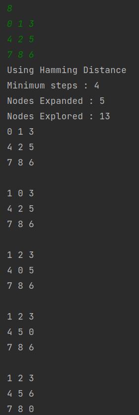

# java-NPuzzleSolver
An implementation of nxn dimensional puzzle solver using AI in java

## Implementing A-star(A*) to solve N-Puzzle
## What is N-Puzzle?
N-Puzzle or sliding puzzle is a popular puzzle that consists of N tiles where N can be 8, 15, 24 and so on. 
The puzzle is divided into √(N+1) rows and √(N+1) columns eg. 15-Puzzle will have 4 rows and 4 columns, an 8-Puzzle will have 3 rows and 3 columns and so on. 
The puzzle consists of one empty space where the tiles can be moved and thus the puzzle is solved when a particular goal pattern is formed like the following 
is one of the variant goal pattern.
| 1  | 2  | 3  | 4  |
|----|----|----|----|
| 5  | 6  | 7  | 8  |
| 9  | 10 | 11 | 12 |
| 13 | 14 | 15 |    |

## Heuristics used
* Hamming Distance/Misplaced Tiles
  * Just as the name suggests, this heuristics returns the number of tiles that are not in their final position
* Manhattan Distance/Taxicab geometry
  * Manhattan Distance of a tile is the distance or the number of slides/tiles away it is from it’s goal state.
    Thus, for a certain state the Manhattan distance will be the sum of the Manhattan distances of all the tiles except the blank tile.
* Linear Conflict + Manhattan Distance/Taxicab geometry
  * Two tiles ‘a’ and ‘b’ are in a linear conflict if they are in the same row or column ,
    also their goal positions are in the same row or column and the goal position of one of the tiles is blocked by the other tile in that row.
    
## Input
* N - Dimension of the matrix (NxN)
* NxN numbers of the puzzle
## Output
* Each steps of the solution using each heuristics(if solvable)

